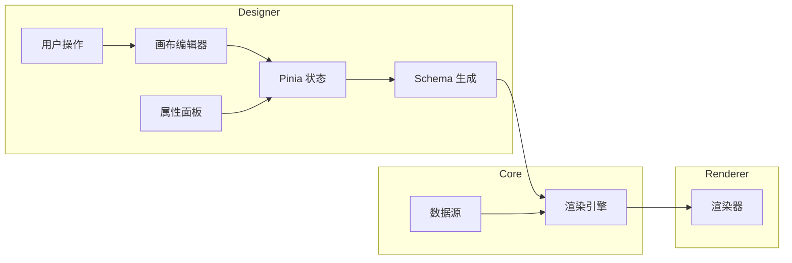
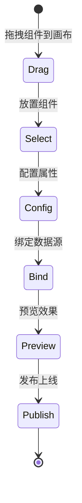
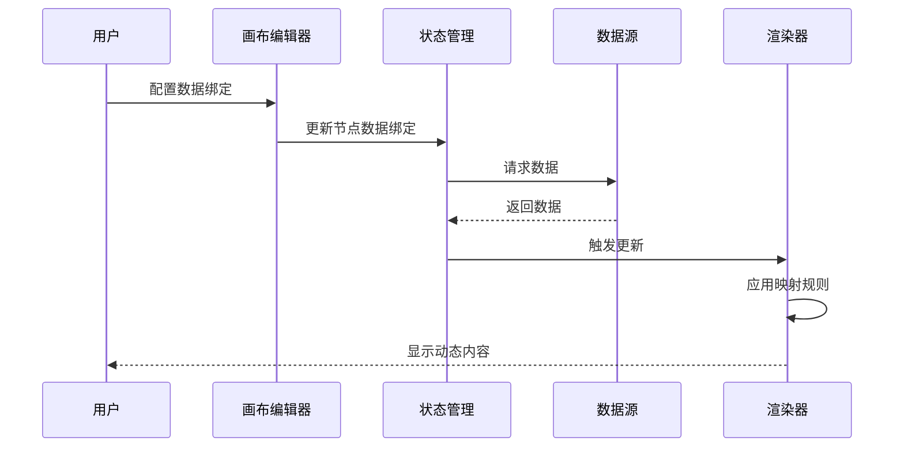

# 架构设计

## 概述

vue-visual-screen-designer 是一个基于 Vue 3 的低代码可视化大屏设计器，旨在帮助用户通过拖拽方式快速构建数据可视化大屏。该系统支持组件化设计、实时预览、多数据源接入，适用于工业监控、指挥中心、数据展示等场景。

系统采用双端分离架构：
- **设计器端 (v2-designer)**：提供可视化编辑能力，支持组件配置、画布编辑、属性设置
- **渲染器端 (v2-renderer)**：负责大屏的最终展示，支持高性能渲染和数据绑定

## 技术栈

### 核心框架
- **Vue 3.5** - 响应式前端框架
- **TypeScript 5.9** - 类型安全
- **Vite (beta)** - 构建工具

### 可视化与图形
- **Antv X6 3.1** - 流程图与节点编辑器
- **ECharts 6.0** - 图表库
- **Fabric 7.2** -  Canvas 2D 渲染

### UI 与状态
- **Naive UI 2.43** - Vue 3 组件库
- **Pinia 3.0** - 状态管理
- **Tailwind CSS 3.4** - 原子化 CSS

### 数据与存储
- **localforage** - 本地存储抽象
- **Vue Router 5** - 路由管理

### 工程化
- **Turbo** - Monorepo 构建编排
- **Vitest** - 单元测试
- **ESLint + Oxlint** - 代码检查

## 项目结构

```
vue-visual-screen-designer/
├── apps/                          # 应用层
│   ├── v1-designer/               # V1 版本设计器 (Legacy)
│   ├── v2-designer/               # V2 版本设计器 (当前主力)
│   └── v2-renderer/               # V2 版本渲染器
├── packages/                      # 共享包层
│   ├── core/                      # 核心引擎 (画布、组件、类型)
│   ├── ui/                        # UI 组件库
│   └── v2-shared/                 # V2 版本共享 (DTO、适配器、校验)
├── turbo.json                    # Turbo 构建配置
└── pnpm-workspace.yaml            # PNPM 工作区配置
```

### apps/v2-designer/ 结构

```
apps/v2-designer/
├── src/
│   ├── views/                     # 页面视图
│   │   ├── EditorView.vue        # 主编辑器视图
│   │   ├── PreviewView.vue       # 预览视图
│   │   ├── ReleaseDetailView.vue # 发布详情视图
│   │   └── AppManagerView.vue    # 应用管理视图
│   ├── components/v2/            # V2 组件
│   │   ├── editor/               # 编辑器核心组件
│   │   │   ├── CanvasEditorV2.vue    # 画布编辑器
│   │   │   ├── ToolbarV2.vue          # 工具栏
│   │   │   ├── PropertyPanelV2.vue    # 属性面板
│   │   │   ├── LayerPanelV2.vue       # 图层面板
│   │   │   └── ...
│   │   ├── nodes/                # 组件节点
│   │   │   ├── ChartNode.vue     # 图表组件
│   │   │   ├── TableNode.vue     # 表格组件
│   │   │   ├── GaugeNode.vue     # 仪表盘组件
│   │   │   └── ...
│   │   └── common/               # 通用组件
│   ├── composables/              # 组合式函数
│   │   ├── useGraphV2.ts         # 图形操作
│   │   ├── useEditorCommands.ts  # 编辑命令
│   │   ├── useScaleAdapter.ts    # 缩放适配
│   │   └── ...
│   ├── stores/                   # Pinia 状态管理
│   │   └── v2/
│   │       ├── canvasStoreV2.ts  # 画布状态
│   │       ├── editorStoreV2.ts  # 编辑器状态
│   │       └── workspaceStoreV2.ts # 工作区状态
│   ├── api/                      # API 层
│   ├── registry/                 # 注册表 (组件/图形)
│   ├── plugins/                  # 插件 (X6 节点、ECharts)
│   └── router/                   # 路由配置
└── package.json
```

### packages/core/ 结构

```
packages/core/
├── src/
│   ├── engine/                   # 渲染引擎
│   ├── components/               # 基础组件
│   ├── canvas/                   # 画布核心
│   ├── types/                    # 类型定义
│   │   └── schema.ts            # Schema v2.1 规范
│   ├── hooks/                    # 核心 Hooks
│   └── utils/                    # 工具函数
└── package.json
```

## 子系统

### 1. 画布编辑器子系统

**目的**：提供可视化拖拽编辑能力，支持组件 placement、连线、图层管理

**位置**：`apps/v2-designer/src/components/v2/editor/`

**关键文件**：
- `CanvasEditorV2.vue` - 画布主组件，集成 Antv X6
- `ToolbarV2.vue` - 工具栏，提供组件选择
- `PropertyPanelV2.vue` - 属性配置面板
- `LayerPanelV2.vue` - 图层管理
- `SketchRulerV2.vue` - 标尺组件

**依赖**：
- `@antv/x6` - 图形引擎
- `@vue-visual-screen/core` - 核心类型
- `@vue-visual-screen/ui` - UI 组件

**被依赖**：
- 组件节点库
- 状态管理

### 2. 组件节点子系统

**目的**：提供各类可视化组件，支持属性配置和数据绑定

**位置**：`apps/v2-designer/src/components/v2/nodes/`

**关键文件**：
- `ChartNode.vue` - ECharts 图表组件
- `TableNode.vue` - 数据表格
- `GaugeNode.vue` - 仪表盘
- `DigitalNode.vue` - 数字翻牌
- `ProgressBarNode.vue` - 进度条

**依赖**：
- `echarts` - 图表渲染
- `@antv/x6-vue-shape` - Vue 节点封装

### 3. 渲染引擎子系统

**目的**：高性能渲染大屏页面，支持数据动态更新

**位置**：`apps/v2-renderer/`

**依赖**：
- `@vue-visual-screen/core` - 核心渲染逻辑
- `echarts` - 图表渲染

### 4. Schema 数据模型

**目的**：定义大屏配置的序列化规范

**位置**：`packages/core/src/types/schema.ts`

**核心接口**：
- `CanvasSchema` - 根 schema，包含画布、节点、连线、数据源
- `WidgetNode` - 组件节点
- `GraphNode` - 图形节点
- `EdgeSchema` - 连线定义
- `DataSourceConfig` - 数据源配置

### 5. 工作区管理子系统

**目的**：管理系统中的应用、页面、发布版本

**位置**：`apps/v2-designer/src/stores/v2/workspaceStoreV2.ts`

**关键文件**：
- `WorkspaceApi.ts` - API 调用
- `workspaceRepository.ts` - 数据仓库

### 6. 主题系统

**目的**：提供多主题支持（深色、浅色、赛博、工业）

**位置**：`apps/v2-designer/src/stores/v2/themeStoreV2.ts`

**主题类型**：
- `dark` - 深色主题
- `light` - 浅色主题
- `cyber` - 赛博朋克风格
- `industrial` - 工业风格

## 数据流



## 组件生命周期



## 数据绑定流程



## 关键技术决策

### 1. 为什么选择 Antv X6？
- 支持自定义节点和边
- 完善的交互事件系统
- 高性能 Canvas 渲染
- 良好的 Vue 集成支持

### 2. Schema 版本策略
- 当前版本：v2.1
- 向前兼容设计
- 支持 schema 迁移

### 3. Monorepo 结构
- 共享业务逻辑通过 packages 复用
- 设计器与渲染器独立部署
- Turbo 按需构建提升性能
