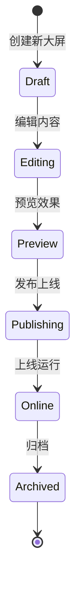

# Schema

Schema 是低代码大屏配置的核心序列化规范，定义了画布、节点、连线、数据源等完整的数据结构。

## 什么是 Schema？

Schema 是大屏配置的 JSON 描述格式，通过 Schema 可以完整还原设计器中的画布布局、组件属性、连线关系和数据绑定配置。当前版本为 **v2.1**。

## 代码位置

| 方面 | 位置 |
|------|------|
| 类型定义 | `packages/core/src/types/schema.ts` |
| Schema 适配器 | `packages/v2-shared/src/adapters/schema-adapter.ts` |
| 校验器 | `packages/v2-shared/src/validators/index.ts` |

## 结构

```typescript
interface CanvasSchema {
  version: '2.1'
  canvas: CanvasConfig        // 画布配置
  nodes: CanvasNode[]        // 节点列表
  edges: EdgeSchema[]        // 连线列表
  datasources: DataSourceConfig[]  // 数据源列表
  variables: VariableSchema[]      // 变量列表
  events: EventBinding[]            // 事件绑定
  meta?: MetaInfo                  // 元信息
}
```

### 核心字段

| 字段 | 类型 | 描述 |
|------|------|------|
| `version` | string | Schema 版本号，当前为 `2.1` |
| `canvas` | CanvasConfig | 画布尺寸、背景、网格等配置 |
| `nodes` | CanvasNode[] | 所有节点（组件节点和图形节点） |
| `edges` | EdgeSchema[] | 所有连线 |
| `datasources` | DataSourceConfig[] | 数据源配置列表 |
| `variables` | VariableSchema[] | 页面级变量 |
| `events` | EventBinding[] | 事件动作绑定 |

## 画布配置

```typescript
interface CanvasConfig {
  width: number           // 画布宽度 (像素)
  height: number          // 画布高度 (像素)
  background: string      // 背景色
  backgroundImage?: string  // 背景图片 URL
  backgroundOpacity: number // 背景透明度 [0-1]
  grid: GridConfig       // 网格配置
  scale: number          // 缩放比例
  offsetX: number        // X 轴偏移
  offsetY: number        // Y 轴偏移
}

interface GridConfig {
  enabled: boolean       // 是否启用网格
  size: number           // 网格大小
  type: 'dot' | 'line' | 'mesh'  // 网格类型
  color: string          // 网格颜色
  snap: boolean          // 是否吸附到网格
}
```

## 不变量

这些规则对有效的 Schema 必须始终成立：

1. **节点 ID 唯一性**: 所有节点的 `id` 必须唯一
2. **连线有效性**: 连线的 `source` 和 `target` 必须指向存在的节点 ID
3. **数据源引用**: 所有 `dataBinding.dataSourceId` 必须指向 `datasources` 中存在的 ID

## 生命周期



### 状态描述

| 状态 | 描述 | 允许的转换 |
|------|------|-----------|
| `draft` | 初始状态，可编辑 | → editing |
| `editing` | 正在编辑 | → draft, preview |
| `preview` | 预览效果 | → editing, publishing |
| `publishing` | 发布中 | → online, editing |
| `online` | 上线运行 | → archived |
| `archived` | 已归档 | （终态） |

## 版本兼容性

Schema v2.1 向前兼容 v2.0，主要改进：

- 新增 `stateMapping` 支持
- 新增更多数据源类型
- 优化主题配置结构

迁移工具位于 `packages/v2-shared/src/adapters/schema-adapter.ts`
