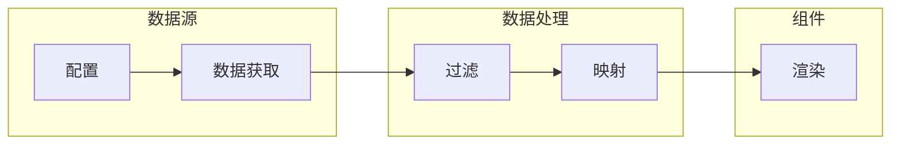

# 数据源

数据源是低代码大屏系统中的核心概念，用于定义动态数据的接入方式，支持多种协议和数据类型。

## 什么是数据源？

数据源（DataSource）是组件节点与后端数据之间的桥梁。通过配置数据源，组件可以实时获取并展示动态数据，支持轮询、缓存、重试等高级特性。

## 代码位置

| 方面 | 位置 |
|------|------|
| 类型定义 | `packages/core/src/types/schema.ts` |
| 数据获取逻辑 | `packages/core/src/engine/` |
| 数据源管理 UI | `apps/v2-designer/src/components/v2/editor/` |

## 数据源结构

```typescript
interface DataSourceConfig {
  id: string                      // 唯一标识
  name: string                   // 显示名称
  type: DataSourceType            // 数据源类型
  config: DataSourceSpecificConfig  // 类型特定配置
  polling?: PollingConfig         // 轮询配置
  cache?: CacheConfig             // 缓存配置
  retry?: RetryConfig             // 重试配置
}
```

## 数据源类型

| 类型 | 描述 | 适用场景 |
|------|------|---------|
| `rest` | REST API | HTTP 接口数据 |
| `websocket` | WebSocket | 实时推送数据 |
| `graphql` | GraphQL | 复杂查询 |
| `mqtt` | MQTT 协议 | IoT 设备数据 |
| `static` | 静态数据 | 固定配置数据 |
| `mysql` | MySQL 数据库 | 关系型数据库 |
| `postgresql` | PostgreSQL 数据库 | 时序数据 |
| `influxdb` | InfluxDB | 监控指标数据 |

## 类型特定配置

### REST 数据源

```typescript
interface RESTConfig {
  url: string                         // 请求 URL
  method: 'GET' | 'POST' | 'PUT' | 'DELETE'  // HTTP 方法
  headers?: Record<string, string>   // 请求头
  params?: Record<string, unknown>   // URL 参数
  body?: unknown                     // 请求体
}
```

### WebSocket 数据源

```typescript
interface WebSocketConfig {
  url: string                         // WebSocket URL
  protocols?: string[]               // 子协议
  reconnect?: boolean                // 是否自动重连
  reconnectInterval?: number         // 重连间隔 (毫秒)
}
```

### MQTT 数据源

```typescript
interface MQTTConfig {
  host: string                       // MQTT 服务器地址
  port: number                       // 端口号
  username?: string                  // 用户名
  password?: string                  // 密码
  topics: string[]                   // 订阅主题
}
```

### 静态数据源

```typescript
interface StaticConfig {
  data: unknown                      // 静态 JSON 数据
}
```

### SQL 数据源

```typescript
interface SQLConfig {
  host: string                       // 数据库地址
  port: number                       // 端口号
  database: string                   // 数据库名
  username: string                   // 用户名
  password: string                   // 密码
  query: string                      // 查询语句
}
```

## 高级配置

### 轮询配置

```typescript
interface PollingConfig {
  enabled: boolean          // 是否启用轮询
  interval: number         // 轮询间隔 (毫秒)
  jitter?: boolean         // 是否添加随机抖动
}
```

### 缓存配置

```typescript
interface CacheConfig {
  enabled: boolean         // 是否启用缓存
  ttl: number             // 缓存时间 (秒)
}
```

### 重试配置

```typescript
interface RetryConfig {
  maxAttempts: number      // 最大重试次数
  delay: number           // 重试延迟 (毫秒)
}
```

## 数据绑定

组件通过数据绑定使用数据源：

```typescript
interface DataBinding {
  dataSourceId: string                  // 引用的数据源 ID
  field: string                         // 数据字段路径 (支持 JSON Path)
  filter?: string                        // 数据过滤表达式
  mapping?: Record<string, string>       // 字段映射
  refreshInterval?: number              // 覆盖数据源的刷新间隔
}
```

## 数据流程



## 最佳实践

1. **合理设置轮询间隔**：根据数据更新频率设置，避免请求过于频繁
2. **使用缓存**：对于变化不频繁的数据启用缓存，减少请求
3. **配置重试**：网络不稳定时配置重试策略提高可靠性
4. **字段映射**：使用映射转换后端字段名为前端友好名称
