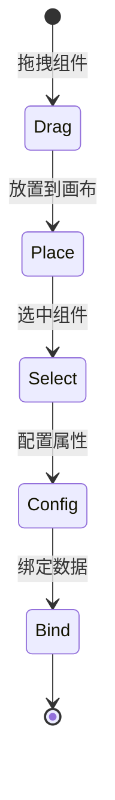

# 组件节点

组件节点是低代码大屏设计器中的核心可视化元素，用户通过拖拽组件到画布上来构建大屏界面。

## 什么是组件节点？

组件节点是 **Widget 类型的节点**，代表具体的可视化组件（如图表、表格、文本等）。每个组件节点包含位置、尺寸、样式、属性和数据绑定等信息。

## 代码位置

| 方面 | 位置 |
|------|------|
| 类型定义 | `packages/core/src/types/schema.ts` |
| 组件实现 | `apps/v2-designer/src/components/v2/nodes/` |
| 组件注册 | `apps/v2-designer/src/registry/shapes.ts` |
| 渲染器组件 | `apps/v2-renderer/src/components/` |

## 节点结构

```typescript
interface WidgetNode {
  id: string                // 唯一标识
  nodeKind: 'widget'        // 节点类型：组件
  type: string              // 组件类型标识
  layout: NodeLayout        // 布局信息
  style?: NodeStyle         // 样式配置
  props: Record<string, unknown>  // 组件属性
  dataBinding?: DataBinding      // 数据绑定
  parent?: string           // 父节点 ID
  locked?: boolean          // 是否锁定
  hidden?: boolean          // 是否隐藏
}

interface NodeLayout {
  x: number                 // X 坐标
  y: number                 // Y 坐标
  width: number             // 宽度
  height: number            // 高度
  rotation?: number        // 旋转角度
  zIndex?: number           // 层级
}
```

## 组件类别

| 类别 | 描述 | 示例组件 |
|------|------|---------|
| `chart` | 图表组件 | 折线图、柱状图、饼图、仪表盘 |
| `map` | 地图组件 | 中国地图、世界地图 |
| `data` | 数据组件 | 数字翻牌、表格、列表 |
| `decoration` | 装饰组件 | 边框、背景、文本 |
| `container` | 容器组件 | 容器、选项卡 |
| `media` | 媒体组件 | 图片、视频 |
| `graph` | 图形组件 | 流程图节点 |

## 内置组件

### 图表类
- **ChartNode** - 通用图表组件，基于 ECharts
- **GaugeNode** - 仪表盘
- **ProgressBarNode** - 进度条

### 数据类
- **DigitalNode** - 数字翻牌
- **TableNode** - 数据表格
- **ListNode** - 列表组件
- **TimelineNode** - 时间轴

### 装饰类
- **AlertNode** - 告警提示
- **IconNode** - 图标
- **CoolingFan** - 冷却风扇动画

### 流程类
- **FlowNode** - 流程节点
- **StorageTank** - 储罐

## 组件注册

组件通过 `ComponentMeta` 进行注册：

```typescript
interface ComponentMeta {
  type: string              // 组件类型标识
  name: string             // 显示名称
  category: ComponentCategory  // 组件类别
  icon: string             // 图标名称
  defaultProps: Record<string, unknown>  // 默认属性
  defaultSize: Size        // 默认尺寸
  propsSchema: JSONSchema  // 属性 JSON Schema
  resizable: boolean       // 是否可调整大小
}
```

## 组件开发

### 创建新组件

1. 在 `apps/v2-designer/src/components/v2/nodes/` 创建 Vue 组件
2. 实现 `props` 接收组件属性
3. 在 `apps/v2-designer/src/registry/shapes.ts` 注册组件

### 示例

```typescript
// 注册新组件
export const customComponents = [
  {
    type: 'custom-counter',
    name: '自定义计数器',
    category: 'data',
    icon: 'Hash',
    defaultSize: { width: 200, height: 60 },
    defaultProps: {
      prefix: '',
      suffix: '',
      decimal: 0
    },
    propsSchema: {
      type: 'object',
      properties: {
        prefix: { type: 'string', default: '' },
        suffix: { type: 'string', default: '' },
        decimal: { type: 'number', default: 0 }
      }
    },
    resizable: true
  }
]
```

## 数据绑定

组件支持动态数据绑定：

```typescript
interface DataBinding {
  dataSourceId: string           // 数据源 ID
  field: string                 // 数据字段路径
  filter?: string               // 数据过滤器
  mapping?: Record<string, string>  // 字段映射
  refreshInterval?: number      // 刷新间隔 (毫秒)
}
```

## 生命周期


